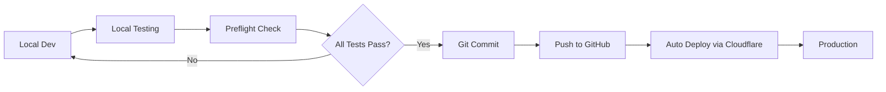

# 🚀 HABIT TRACKER - CLOUDFLARE PAGES DEPLOYMENT GUIDE

## 📋 Table of Contents
- [Overview](#overview)
- [Deployment Workflow](#deployment-workflow)
- [GitHub Setup](#github-setup)
- [Cloudflare Pages Setup](#cloudflare-pages-setup)
- [Deployment Process](#deployment-process)
- [Cost Optimization](#cost-optimization)
- [Rollback Procedures](#rollback-procedures)
- [Monitoring](#monitoring)

---

## 🌟 Overview

This guide covers deployment to Cloudflare Pages, which offers generous free tier limits and fast global CDN distribution.

### **Deployment Philosophy**
```
Local Testing (FREE) → GitHub (Version Control) → Cloudflare Pages (Production)
              ↑                                            ↑
         Test Everything                            Automatic Deploy
```

### **Key Principles**
- ✅ **Test everything locally first** (costs $0)
- ✅ **Only deploy tested, working code**
- ✅ **Leverage Cloudflare's automatic deployments**
- ✅ **Use preview deployments for testing**

---

## 🔄 Deployment Workflow



### **Stage-by-Stage Process**

| Stage | Command | Cost | Purpose |
|-------|---------|------|---------|
| 1. Local Test | `npm run test:local` | $0 | Validate everything |
| 2. Preflight | `npm run preflight` | $0 | Final checks |
| 3. Git Push | `git push` | $0 | Triggers auto-deploy |
| 4. Deploy | Automatic | $0 | Production via Cloudflare |

---

## 🔧 GitHub Setup

### **1. Initialize Repository**

```bash
# In habit-tracker directory
git init
git add .
git commit -m "Initial commit: Habit Tracker v1.0.0"
```

### **2. Create GitHub Repository**

1. Go to https://github.com/new
2. Name: `habit-tracker` or `accountable`
3. Private repository (recommended)
4. **DO NOT** initialize with README
5. Create repository

### **3. Connect Local to GitHub**

```bash
# Replace [YOUR_USERNAME] with your GitHub username
git remote add origin https://github.com/[YOUR_USERNAME]/accountable.git
git branch -M main
git push -u origin main
```

---

## 🌐 Cloudflare Pages Setup

### **Initial Setup (One Time Only)**

#### **Option A: Cloudflare Dashboard (Recommended)**

1. Go to https://dash.cloudflare.com/
2. Navigate to "Workers & Pages" → "Create application" → "Pages"
3. Connect to Git:
   - Select "Connect to Git"
   - Authorize GitHub integration
   - Select your repository
4. **Build settings:**
   - Framework preset: `None` or `Create React App`
   - Build command: `npm run build`
   - Build output directory: `dist`
   - Root directory: `habit-tracker` (if in subdirectory)
5. **Environment variables** (if needed):
   - Add any required environment variables
6. Click "Save and Deploy"

#### **Option B: Wrangler CLI**

```bash
# Install Wrangler globally (one time)
npm install -g wrangler

# Login to Cloudflare
wrangler login

# In habit-tracker directory, create project
wrangler pages project create accountable-habit-tracker

# Deploy manually (optional)
npm run build
wrangler pages deploy dist --project-name=accountable-habit-tracker
```

### **Configure Build Settings**

Create `wrangler.toml` (optional, for CLI deployments):

```toml
name = "accountable-habit-tracker"
compatibility_date = "2024-11-01"

[site]
bucket = "./dist"
```

---

## 📦 Deployment Process

### **🎯 Automatic Deployment (Recommended)**

Once connected to GitHub, Cloudflare automatically deploys on every push:

```bash
# 1. Make changes locally
# 2. Test thoroughly
npm run test:local
npm run preflight

# 3. Commit and push
git add .
git commit -m "Your changes"
git push

# Cloudflare automatically builds and deploys!
```

### **Manual Deployment via CLI**

```bash
# 1. Build locally
npm run build

# 2. Deploy to Cloudflare Pages
wrangler pages deploy dist --project-name=accountable-habit-tracker

# For production branch
wrangler pages deploy dist --project-name=accountable-habit-tracker --branch=main
```

### **Preview Deployments**

Every pull request gets its own preview URL automatically:
- Format: `https://<hash>.accountable-habit-tracker.pages.dev`
- Perfect for testing before merging to main

---

## 💰 Cost Optimization

### **Cloudflare Pages Free Tier**
- **500 builds per month** (very generous!)
- **Unlimited sites**
- **Unlimited requests**
- **Unlimited bandwidth**

### **Comparison with Other Platforms**

| Feature | Cloudflare Pages | Netlify | Vercel |
|---------|-----------------|---------|--------|
| Build minutes | 500/month | 300/month | - |
| Bandwidth | Unlimited | 100GB | 100GB |
| Sites | Unlimited | Limited | Limited |
| Custom domains | ✅ Free | ✅ Free | ✅ Free |

---

## 🔄 Rollback Procedures

### **Via Cloudflare Dashboard**

1. Go to https://dash.cloudflare.com/
2. Navigate to your Pages project
3. Click "View builds"
4. Find the last working deployment
5. Click "..." → "Rollback to this deployment"

### **Via Git**

```bash
# Revert the last commit
git revert HEAD
git push

# OR reset to specific commit
git reset --hard [COMMIT_HASH]
git push --force
```

---

## 📊 Monitoring

### **Cloudflare Analytics**

Free analytics included:
- Page views
- Unique visitors
- Performance metrics
- Web Vitals

Access at: https://dash.cloudflare.com/ → Your project → Analytics

### **Post-Deployment Checklist**

- [ ] Visit production URL
- [ ] Test core functionality
- [ ] Check browser console for errors
- [ ] Test on mobile device
- [ ] Verify data persistence
- [ ] Check Web Vitals in Cloudflare dashboard

---

## 🚨 Troubleshooting

### **Build Failures**

```bash
# Check build logs in Cloudflare dashboard
# OR run locally to debug:
npm run build
```

### **404 Errors on Routes**

Ensure `_redirects` file exists in `public/` directory:
```
/* /index.html 200
```

Or add to `wrangler.toml`:
```toml
[site]
bucket = "./dist"

[[routes]]
pattern = "/*"
status = 200
```

---

## 📝 Deployment Commands Summary

### **Development Workflow**

```bash
# Daily development
npm run dev                    # Develop locally
npm run test:local            # Test everything
npm run preflight            # Final checks

# Deploy via Git (auto-deploy)
git add .
git commit -m "Your changes"
git push                      # Triggers Cloudflare deployment

# Manual deploy (if needed)
npm run deploy:production    # Uses wrangler CLI
```

---

## 🏷️ Version Management

### **Environment-based Deployments**

- **Production**: `main` branch → `accountable-habit-tracker.pages.dev`
- **Preview**: Pull requests → `<hash>.accountable-habit-tracker.pages.dev`
- **Development**: Other branches → `<branch>.accountable-habit-tracker.pages.dev`

---

## 🔗 Custom Domain Setup

1. In Cloudflare Pages dashboard:
   - Go to your project → Custom domains
   - Click "Set up a domain"
   - Enter your domain (e.g., `accountable.yourdomain.com`)
   - Follow DNS configuration instructions

2. SSL certificates are automatic and free!

---

## ⚡ Performance Optimization

Cloudflare Pages automatically provides:
- **Global CDN** - 200+ data centers
- **Auto-minification**
- **Brotli compression**
- **HTTP/3 support**
- **Image optimization** (with Cloudflare Images)

---

## 📋 Quick Reference

### **Essential Commands**

```bash
# Build and test locally
npm run build
npm run serve:prod

# Deploy manually
wrangler pages deploy dist --project-name=accountable-habit-tracker

# View deployment
open https://accountable-habit-tracker.pages.dev
```

---

## ⚠️ IMPORTANT NOTES

1. **Cloudflare Pages is FREE** for most use cases
2. **Automatic deployments** save time and effort
3. **Preview deployments** for every PR
4. **Global CDN** included at no cost
5. **No build minute restrictions** like other platforms

---

## 📞 Support

- **Cloudflare Docs**: https://developers.cloudflare.com/pages/
- **Community**: https://community.cloudflare.com/
- **Status**: https://www.cloudflarestatus.com/

---

**Last Updated:** November 2024
**Version:** 2.0.0
**Platform:** Cloudflare Pages