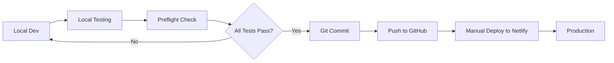

# 🚀 HABIT TRACKER - DEPLOYMENT GUIDE

## 📋 Table of Contents
- [Overview](#overview)
- [Deployment Workflow](#deployment-workflow)
- [GitHub Setup](#github-setup)
- [Netlify Setup](#netlify-setup)
- [Deployment Process](#deployment-process)
- [Cost Optimization](#cost-optimization)
- [Rollback Procedures](#rollback-procedures)
- [Monitoring](#monitoring)

---

## 🌟 Overview

This guide ensures **ZERO wasted Netlify build credits** through comprehensive local testing before deployment.

### **Deployment Philosophy**
```
Local Testing (FREE) → GitHub (Version Control) → Netlify (Production)
              ↑                                            ↑
         Test Everything                            Only When Ready
```

### **Key Principles**
- ✅ **Test everything locally first** (costs $0)
- ✅ **Only deploy tested, working code**
- ✅ **Use staging deployments sparingly**
- ✅ **Batch multiple changes into single deployments**

---

## 🔄 Deployment Workflow



### **Stage-by-Stage Process**

| Stage | Command | Cost | Purpose |
|-------|---------|------|---------|
| 1. Local Test | `npm run test:local` | $0 | Validate everything |
| 2. Preflight | `npm run preflight` | $0 | Final checks |
| 3. Git Push | `git push` | $0 | Version control |
| 4. Deploy | Manual via Netlify UI | 1 build | Production |

---

## 🔧 GitHub Setup

### **1. Initialize Repository**

```bash
# In habit-tracker directory
git init
git add .
git commit -m "Initial commit: Habit Tracker v1.0.0"
```

### **2. Create GitHub Repository**

1. Go to https://github.com/new
2. Name: `habit-tracker`
3. Private repository (recommended)
4. **DO NOT** initialize with README
5. Create repository

### **3. Connect Local to GitHub**

```bash
# Replace [YOUR_USERNAME] with your GitHub username
git remote add origin https://github.com/[YOUR_USERNAME]/habit-tracker.git
git branch -M main
git push -u origin main
```

### **4. IMPORTANT: Disable Auto-Deploy**

⚠️ **CRITICAL TO SAVE CREDITS** ⚠️

We will NOT use automatic deployments. This prevents accidental builds from commits.

---

## 🌐 Netlify Setup

### **Initial Setup (One Time Only)**

#### **Option A: Netlify CLI (Recommended)**

```bash
# Install Netlify CLI globally (one time)
npm install -g netlify-cli

# Login to Netlify
netlify login

# Initialize site (in habit-tracker directory)
netlify init

# Choose:
# - Create & configure a new site
# - Team: Your team
# - Site name: your-habit-tracker (or leave blank for random)
# - Build command: npm run build
# - Directory to deploy: dist
# - DO NOT set up continuous deployment
```

#### **Option B: Netlify Web UI**

1. Go to https://app.netlify.com
2. Click "Add new site" → "Import an existing project"
3. Connect to GitHub
4. Select your repository
5. **Build settings:**
   - Build command: `npm run build`
   - Publish directory: `dist`
6. **IMPORTANT:** After creation, go to:
   - Site Settings → Build & deploy → Continuous deployment
   - Click "Stop builds" or disconnect GitHub

### **Environment Variables (If Needed)**

```bash
# Via CLI
netlify env:set VARIABLE_NAME value

# Via UI
# Site Settings → Environment variables → Add variable
```

---

## 📦 Deployment Process

### **🎯 RECOMMENDED: Manual Deploy (Saves Credits)**

#### **Method 1: Netlify CLI (Preferred)**

```bash
# 1. Complete local testing
npm run test:local
npm run preflight

# 2. Build locally
npm run build

# 3. Deploy to production (skips Netlify build)
netlify deploy --dir=dist --prod

# You'll see:
# ✔ Finished hashing 15 files
# ✔ CDN requesting 10 files
# ✔ Deployed to https://your-site.netlify.app
```

#### **Method 2: Drag & Drop**

1. Build locally: `npm run build`
2. Open https://app.netlify.com
3. Go to your site
4. Drag the `dist` folder to the deployment area
5. Done! (Uses 0 build credits)

### **⚠️ OPTIONAL: Staging Deploy (Uses Credits)**

Only use when absolutely necessary:

```bash
# Deploy to staging URL (not production)
netlify deploy --dir=dist

# You get a preview URL like:
# https://5f3e4d2c3a4b5c6d7e8f--your-site.netlify.app
```

### **❌ AVOID: Auto-Deploy from GitHub**

This uses build credits for every commit. Only enable if you have unlimited credits.

---

## 💰 Cost Optimization

### **Netlify Free Tier Limits**
- 300 build minutes per month
- 100 GB bandwidth
- 1 concurrent build

### **Credit-Saving Strategies**

| Strategy | Savings | Implementation |
|----------|---------|----------------|
| Local builds only | 90% | `netlify deploy --dir=dist` |
| Batch changes | 50% | Deploy weekly, not daily |
| Disable auto-deploy | 70% | Manual deploys only |
| Use drag & drop | 100% | Zero build credits |

### **Build Time Estimates**
- Netlify build: ~2-3 minutes (uses credits)
- Local build + deploy: ~30 seconds (uses 0 credits)

### **Monthly Budget Example**
```
Free tier: 300 minutes
Average build: 3 minutes
Max builds: 100 per month

With local builds:
- Unlimited deployments
- 0 minutes used
- $0 cost
```

---

## 🔄 Rollback Procedures

### **Quick Rollback (Netlify UI)**

1. Go to https://app.netlify.com
2. Select your site
3. Go to "Deploys" tab
4. Find last working deploy
5. Click "..." → "Publish deploy"
6. Instant rollback!

### **Git-Based Rollback**

```bash
# Find last good commit
git log --oneline

# Revert to specific commit
git revert HEAD
# OR
git reset --hard [COMMIT_HASH]

# Deploy fixed version
npm run build
netlify deploy --dir=dist --prod
```

---

## 📊 Monitoring

### **Post-Deployment Checklist**

After each deployment:

- [ ] Visit production URL
- [ ] Test core functionality
- [ ] Check browser console for errors
- [ ] Test on mobile device
- [ ] Verify data persistence
- [ ] Check performance (Lighthouse)

### **Monitoring Tools**

1. **Netlify Analytics** (if enabled)
   - Page views
   - Top pages
   - Resources

2. **Browser Testing**
   ```bash
   # Open multiple browsers
   open https://your-site.netlify.app  # macOS
   xdg-open https://your-site.netlify.app  # Linux
   ```

3. **Performance Check**
   - Chrome DevTools → Lighthouse
   - Target scores: All >90

---

## 🚨 Emergency Procedures

### **Site is Down**

```bash
# 1. Check Netlify status
open https://www.netlifystatus.com

# 2. Check latest deploy
netlify status

# 3. Rollback if needed
# (See rollback procedures above)
```

### **Build Credits Running Low**

```bash
# Switch to manual deploys immediately
# Build locally
npm run build

# Deploy without building
netlify deploy --dir=dist --prod
```

---

## 📝 Deployment Checklist

### **Before Every Deployment**

```bash
# 1. Pull latest changes
git pull

# 2. Install dependencies
npm install

# 3. Run full test suite
npm run test:local

# 4. Run preflight
npm run preflight

# 5. Test production build
npm run serve:prod
# Test at http://localhost:3000

# 6. If all pass, deploy
netlify deploy --dir=dist --prod
```

### **Deployment Commands Summary**

```bash
# Daily development
npm run dev                    # Develop
npm run test:local             # Test everything
npm run preflight              # Final check

# Deployment (choose one)
netlify deploy --dir=dist --prod    # CLI deploy (recommended)
npm run deploy:production            # Automated deploy
# OR drag dist/ folder to Netlify     # Manual upload

# Post-deployment
open https://your-site.netlify.app  # Verify
```

---

## 🏷️ Version Management

### **Semantic Versioning**

Update `package.json` version before major deployments:

```json
{
  "version": "1.0.0"  // major.minor.patch
}
```

- **Patch (1.0.1)**: Bug fixes
- **Minor (1.1.0)**: New features, backward compatible
- **Major (2.0.0)**: Breaking changes

### **Git Tags**

```bash
# Tag releases
git tag -a v1.0.0 -m "Initial release"
git push origin v1.0.0
```

---

## 📋 Quick Reference

### **Zero-Credit Deployment**

```bash
# The most cost-effective way:
npm run build && netlify deploy --dir=dist --prod
```

### **Full Safe Deployment**

```bash
# Complete safety check + deploy
npm run preflight && npm run build && netlify deploy --dir=dist --prod
```

### **Emergency Rollback**

```bash
# Via Netlify UI is fastest
# OR via CLI:
git checkout [LAST_GOOD_COMMIT]
npm run build
netlify deploy --dir=dist --prod
```

---

## ⚠️ CRITICAL REMINDERS

1. **NEVER enable auto-deploy** unless you have unlimited credits
2. **ALWAYS test locally first** - it's free!
3. **Build locally, deploy the dist/** - saves 100% of build credits
4. **Batch your deployments** - deploy weekly, not after every change
5. **Monitor your credit usage** - Check Netlify dashboard regularly

---

## 📞 Support

- **Netlify Docs**: https://docs.netlify.com
- **Netlify Support**: https://www.netlify.com/support/
- **GitHub Issues**: Create issue in your repository

---

**Last Updated:** November 2024
**Version:** 1.0.0
**Deployment Method:** Manual (Credit-Optimized)